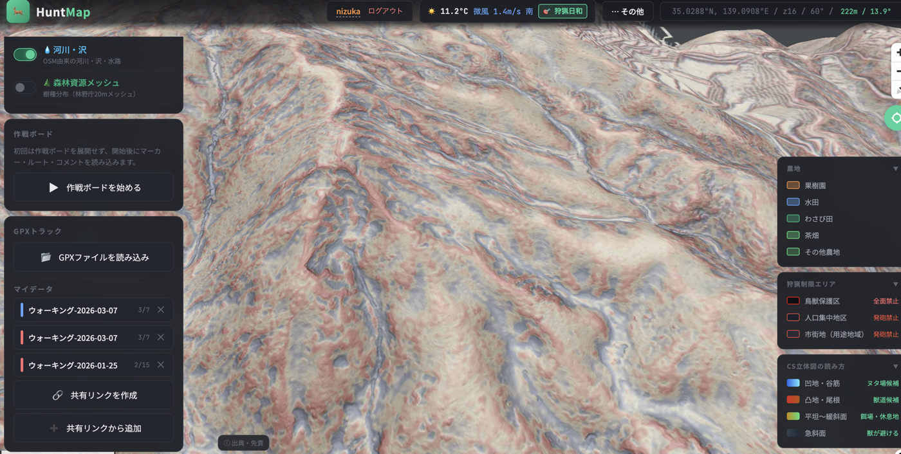
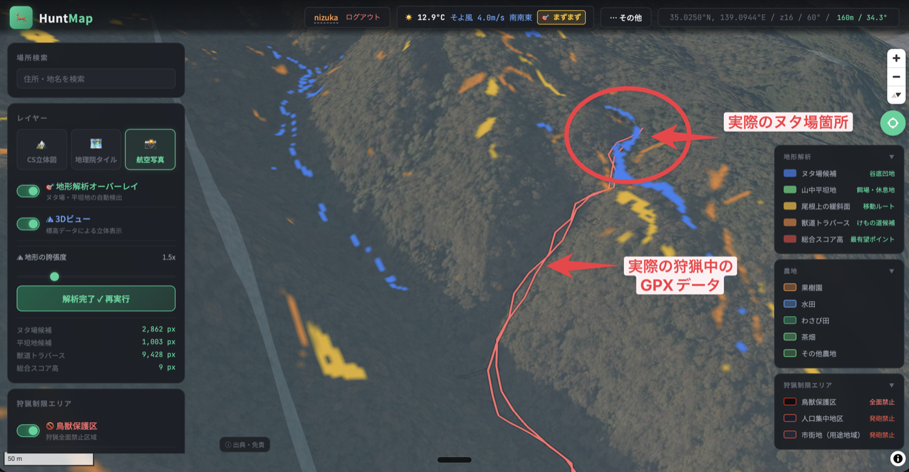

# ヌタ場はAIで見つかるのか — 地形データ×GPSログで獣の痕跡を予測する

nizuka

## はじめに

「ヌタ場」をご存知だろうか。シカやイノシシが泥浴びをする窪地のことで、猟師にとっては獲物の行動を読む重要な手がかりだ。地元の猟師は何度も山に入るうちにヌタ場の位置を把握していくが、その知識はあくまで個人の経験に閉じている。よその山に入る猟師や、猟を始めたばかりの初心者には、ヌタ場を事前に把握する術がない。

筆者はエンジニアとして狩猟用地形解析Webアプリ「HuntMap」（hunt-map.com）を開発している。MapLibre GL JSと国土地理院データを使い、全国の狩猟関連情報を地図上に可視化するアプリだ。ある日思いついた。**地形データをアルゴリズムで解析すれば、ヌタ場の候補地を自動で予測できるのではないか。**

本稿では、国土地理院の標高データ（DEM）を使ってヌタ場予測エンジンを実装し、実際の猟場で検証した体験記を書く。

## ヌタ場とは何か

ヌタ場は、シカやイノシシが体についたダニや寄生虫を落とすために泥浴びをする場所だ。地形的には以下の特徴がある。

- **窪地**（凹地形）であること
- **緩傾斜**であること（急斜面では水が溜まらない）
- **谷筋**に近いこと（水の供給がある）
- **丸い形状**であること（細長い沢筋とは異なる）

つまり、「緩い傾斜の、丸い窪地で、谷底付近にある場所」がヌタ場の候補となる。これらはすべて数値化できる地形の特徴だ。

※ 上記は代表的な地形パターンを示す。実際にはなだらかな斜面上の窪地など、谷筋以外にもヌタ場は存在する。


## 使ったデータ：国土地理院DEMタイル



国土地理院は標高データをPNGタイル形式で無償公開している。1ピクセルが約5mメッシュの解像度で、日本全土をカバーする。

```
標高(m) = (R × 65536 + G × 256 + B) × 0.01
```

RGBの各ピクセル値をこの式に入れるだけで標高が得られる。HuntMapではdem5a（航空レーザー測量）→ dem5b → dem の順にフォールバックする仕組みにした。5mメッシュならヌタ場サイズの窪地（数m〜十数m）も検出可能な解像度だ。

## 4つの地形指標

標高データから、以下の4つの指標を計算する。なお、各指標の数式や閾値の選定にはClaude（Anthropic）を活用した。ヌタ場の地形的特徴を言語化し、それを数式に落とし込む過程でAIとの対話を繰り返している。

### 1. 傾斜度（Slope）— Sobelオペレータ

隣接ピクセルとの標高差から傾斜角を算出する。Sobelオペレータを使い、X方向・Y方向の勾配を求めて合成する。

```
dz/dx = ((右上 + 2×右 + 右下) - (左上 + 2×左 + 左下)) / (8 × ピクセルサイズ)
dz/dy = ((左下 + 2×下 + 右下) - (左上 + 2×上 + 右上)) / (8 × ピクセルサイズ)
傾斜角 = atan(√(dz/dx² + dz/dy²))
```

ヌタ場の条件：**3°〜10°程度の緩傾斜**。3°未満は人工的な平坦地（道路・グラウンド等）を除外するための下限だ。

### 2. 凹凸度（Curvature）— ラプラシアン

地形の凹凸をラプラシアン（二次微分）で算出する。

```
曲率 = (上 + 下 + 左 + 右 - 4×中央) / ピクセルサイズ²
```

正の値は凹地形（窪地・谷）、負の値は凸地形（尾根・丘）を示す。ヌタ場候補には**正の曲率**を条件とする。

### 3. TPI（地形位置指標）

あるピクセルの標高と、周囲75m圏内の平均標高との差。

```
TPI = 中央の標高 - 周囲の平均標高
```

- 負の値 → 周囲より低い（谷底）
- 正の値 → 周囲より高い（尾根）

ヌタ場候補には **TPI < -0.3** を条件とする。谷底付近を抽出するためだ。

### 4. 形状比（Shape Ratio）— 主成分分析

ここが肝だ。上記3つの条件だけでは、沢筋（細長い谷）もヌタ場候補として大量にヒットしてしまう。ヌタ場は**丸い窪地**なので、細長い地形を除外する必要がある。この形状比は、実際に猟場で沢筋がヒットしすぎる問題に直面し、現地検証を経て追加した指標だ。

対象ピクセル周辺のTPI負値領域を集め、共分散行列の固有値比から形状を判定する。

```
形状比 = √(λ₁ / λ₂)   （λ₁ ≥ λ₂）
```

- 形状比 ≒ 1.0 → 円形（ヌタ場らしい）→ スコア1.5倍
- 形状比 ≧ 3.0 → 細長い（沢筋）→ スコア0.3倍

つまり「丸い窪地」と「細長い谷」を数学的に分離している。

## スコアリング

4つの指標を組み合わせて、各ピクセルにヌタ場スコアを付与する。

```
nutaScore = (曲率の強さ) × (傾斜の適度さ) × (谷底の深さ) × (形状補正)
```

スコアが0.15を超えた地点を「ヌタ場候補」として青色でマップ上に表示する。同時に、平坦地（緑）、尾根緩斜面（黄）も表示し、猟場の地形を一目で把握できるようにした。

## 実際に山で検証してみた

アルゴリズムを実装してHuntMapに組み込み、実際の猟場で検証した。




### 予測が当たったケース

マップ上で青く表示されたポイントを現地で確認すると、**実際にヌタ場が存在していた**。等高線だけでは読み取りにくい微地形の窪地を正確に抽出できたのは収穫だった。

実際に猟師に同行した際、猟師が元々把握していたヌタ場を目指して山に入った。そのヌタ場の位置がアプリ上の青い候補地と一致していた。猟師の経験知とアルゴリズムの出力が合致したことで、予測の方向性が正しいことを確認できた。

ただし、現時点では網羅的な精度検証はできていない。アルゴリズムが出す候補地の数は広範囲で非常に多く、すべてを現地で確認するのは現実的ではない。今回確認できたのは「既知のヌタ場が候補に含まれていた」という事実であり、偽陽性の割合や見落とし率の定量評価は今後の課題だ。

### 課題

一方で、以下のような限界もある。

- **偽陽性**: 林道の切り通しや崩落跡など、人工的な窪地もヒットする
- **水の有無**: DEMだけでは水源の有無がわからない。水がなければ泥浴びはできない
- **植生の影響**: 航空レーザー測量でも樹木の影響を完全には除去できない
- **季節変動**: ヌタ場は季節によって使われ方が変わるが、地形データは静的

## タイトルの回答：「AIで見つかるのか」

正直に言えば、今回実装したのは**AIではなく、古典的な地形解析アルゴリズム**だ。Sobelオペレータ、ラプラシアン、主成分分析——いずれも画像処理や地理学で数十年使われてきた手法である。

しかし「AIで見つかるのか」への回答は**Yes**だと考えている。理由は2つ。

1. **ルールベースでもここまでできる**。教師データなしで、地形の数学的特徴だけからヌタ場候補を絞り込めることが実証できた。
2. **ここから先がAIの出番**。今回のアルゴリズムで候補を絞り、現地で実際にヌタ場だったかどうかのデータを蓄積すれば、機械学習モデルの教師データになる。GPSログとの突合せで「猟師が実際に立ち寄った窪地」を正解ラベルにできる可能性がある。

つまり、**ルールベース → データ蓄積 → 機械学習** というステップの第一段階を踏んだ、というのが本稿の位置づけだ。

## データの民主化に向けて

現在、HuntMapのモバイル版「HuntLog」を開発中だ。狩猟中のGPSログを自動記録する機能を実装予定で、将来的にユーザーのGPSデータを集約できれば、以下が可能になる。

- **ヌタ場候補地の精度向上**: 実際に猟師が立ち寄った窪地の位置データが蓄積されれば、アルゴリズムの予測精度を検証・改善できる。多くの猟師が繰り返し立ち寄る窪地は、実際のヌタ場である可能性が高い。
- **慣れない猟場でのブリーフィング支援**: 初めての土地では、どこに向かって進めばいいのかわからない。筆者も巻狩りに同行した際、目指すべき方向すら掴めなかった経験がある。地形解析とGPSログの蓄積があれば、未経験の猟場でも事前に地形の特徴を把握した上で山に入れる。

ベテラン猟師の暗黙知を、データとして次の世代に引き継ぐ。それが「狩猟データの民主化」だと考えている。

## おわりに — 年間164億円の被害に、テクノロジーで挑む

ここまで、ヌタ場予測という小さな試みについて書いてきた。最後に、Webエンジニアの筆者が狩猟に興味を持ったきっかけとして、この取り組みの背景にある大きな問題に触れておきたい。

令和5年度、野生鳥獣による全国の農作物被害額は**約164億円**に達した。シカが70億円、イノシシが36億円と、この2種だけで被害の6割以上を占める。前年度から8億円増と、被害は依然として高い水準にある。

一方で、被害を食い止める側の猟師は減り続けている。1975年に51.8万人いた狩猟免許所持者は、現在約21万人と4割以下にまで減少。その約6割が60歳以上だ。地方の人口減少も重なり、有害鳥獣捕獲の担い手不足は深刻化する一方である。

5mメッシュの標高データと数百行のJavaScriptで、ヌタ場の候補地を予測できることがわかった。完璧ではないが、初心者が猟場の地形を読む補助ツールとしては十分に機能する。

猟師が減り、被害が増える。この構造的な問題に対して、テクノロジーにできることがある。ベテランが何年もかけて蓄積した土地の知識を、地形解析アルゴリズムで誰でもアクセスできるようにする。現地検証のデータを蓄積し、機械学習で予測精度を上げていく。将来的にはユーザーの匿名化されたGPSデータを集約し、狩猟の知を民主化する。

狩猟は経験がものを言う世界だ。しかし、**経験の一部をデータとアルゴリズムで補完できれば、限られた人数でもより効率よく山に入れるようになる**。それが、年間164億円の被害を少しでも減らすことにつながると信じている。

## 出典

- 農林水産省「全国の野生鳥獣による農作物被害状況について（令和5年度）」2024年12月27日, https://www.maff.go.jp/j/press/nousin/tyozyu/241227.html
- 環境省「狩猟免許所持者数の推移」, https://www.env.go.jp/nature/choju/docs/docs4/index.html
- 国土地理院「標高タイルの詳細仕様」, https://maps.gsi.go.jp/development/demtile.html
- HuntMap — 狩猟用地形解析Webアプリ, https://hunt-map.com/

---

著者：nizuka
猟師見習い。狩猟の見学をきっかけに、テクノロジーと狩猟を組み合わせた活動を始める。狩猟用地形解析Webアプリ「HuntMap」を開発中。
活動地域：静岡県
専門分野：Webエンジニア
